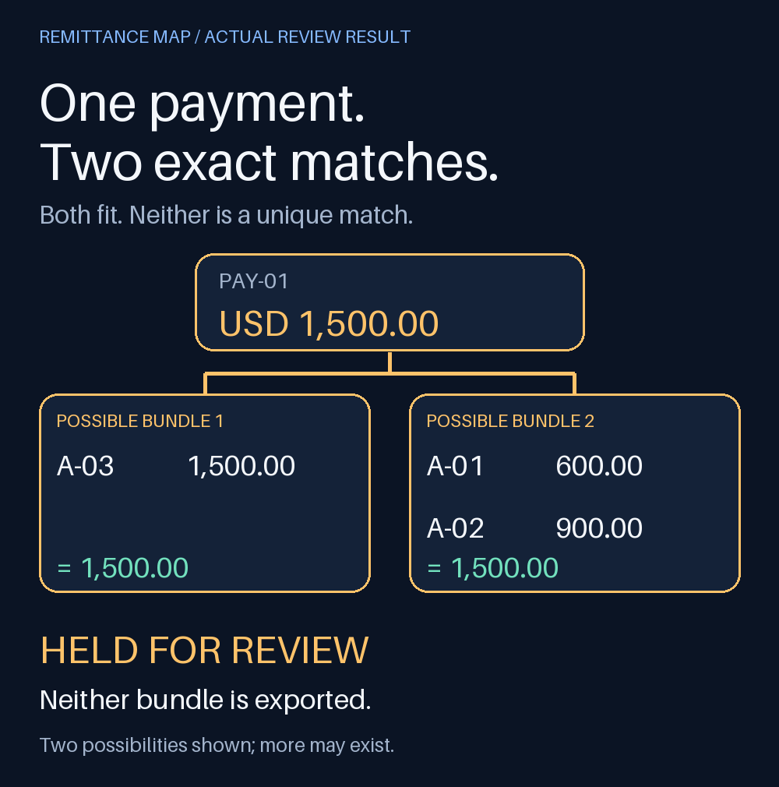

# Remittance Map

**A payment can match perfectly and still have two different explanations.**

Remittance Map turns three CSVs into a local payment-to-invoice review. It finds exact whole-invoice bundles, shows competing explanations, and holds payments that could reuse the same invoice. The output is a set of suggestions for a person to review. Nothing is posted to a bank or accounting system.



In this example, one USD 1,500 payment could settle either a USD 1,500 invoice or two invoices for USD 600 and USD 900. The report shows both possibilities and exports neither. Elsewhere in the same batch, two USD 1,100 payments compete for one invoice, so both are held.

[See the full batch report](docs/overview-001.png): two payments totaling USD 1,700 have unique, disjoint bundles; four totaling USD 4,100 need review. All sample customers, amounts and records are invented.

## Why this exists

Matching a payer name or finding an equal amount doesn't establish which invoices a payment settles. This tool separates those questions:

1. Resolve the payer through your explicit alias table, normalizing case, punctuation and whitespace. It never guesses from a substring or fuzzy name score.
2. Search for whole-invoice combinations within that customer and currency, using integer cents.
3. If two different combinations fit, keep two witnesses and mark the payment for review.
4. Check the complete batch for competing payments. Never suggest using one invoice twice.

An unresolved payment quarantines other suggestions for its customer and currency. An unknown payer quarantines the whole currency, because its invoices could belong to any customer. This deliberately favors false holds over unsupported allocations. Adding a verified alias and rerunning can narrow the review scope.

[Power Query fuzzy merge](https://learn.microsoft.com/en-us/power-query/merge-queries-fuzzy-match) already supports text similarity, scores and transformation tables. It is useful for preparing payer mappings. This tool addresses the next step: exact amount combinations, duplicate allocation conflicts and an inspectable report. It is a small review utility, not a replacement for accounting software or specialized remittance integrations.

## Run the demo

Python 3.10 or newer. No API key or account connection is needed. Once Pillow is installed, processing runs locally.

```sh
python3 -m venv .venv
.venv/bin/python -m pip install -r requirements.txt
.venv/bin/python demo.py --out out
```

On Windows, use `.venv\Scripts\python.exe` in place of `.venv/bin/python`.

Open `out/ambiguity.png` or `out/overview-001.png` in any image viewer. `demo.py` checks the expected six payment decisions and totals. To rerun, choose a new output directory; existing directories are never overwritten.

## Review your own CSVs

Use UTF-8 CSVs with these exact headers and a positive decimal amount (at most two decimal places):

| File | Columns |
| --- | --- |
| Invoices | `invoice_id,customer_id,amount,currency` |
| Payments | `payment_id,payer,amount,currency` |
| Approved aliases | `payer,customer_id` |

Invoices must represent **open balances**. Use stable, unique invoice and payment IDs. Each invoice ID is unique across the complete input. One alias can map to multiple customers; the tool holds that ambiguity instead of choosing the first row. Use three-letter uppercase currency codes. Currencies are never combined or converted.

```sh
.venv/bin/python reconcile.py \
  --invoices examples/invoices.csv \
  --payments examples/payments.csv \
  --aliases examples/aliases.csv \
  --out review-001
```

The new directory contains:

- `plan.json`: every payment decision, amounts in cents, supporting combinations, original input hashes and full input values.
- `suggestions.csv`: only unique, noncompeting payment/invoice ID pairs. Review them before use; this file is not an import into any accounting service.
- `overview-*.png`: all payments, six per page, with the reason for each decision.
- `ambiguity.png`: the first ambiguous payment and two possible bundles, when present.
- `READY.json`: hashes of the completed output files, written last. A directory without this marker is incomplete, for example after a process kill.

Keep outputs private when using real data. The JSON and images contain the information you supplied. Long image labels are shortened to fit; complete values remain in JSON. The supplied image fonts may not cover all writing systems.

## Bounds and deliberate tradeoffs

- At most 1,000 rows per input, eight currencies, and 16 open invoices per customer/currency search. Larger groups are held for review. Subset search is exponential; the cap keeps the behavior bounded and understandable.
- All invoices in the supplied scope are considered; this version does not filter by due date or parse invoice references out of bank descriptions.
- Partial invoice allocations, refunds, fees, credits and foreign-exchange adjustments require review. A payment made up of several whole invoices is supported.
- Two matching bundles prove ambiguity; the report does not claim to enumerate all possible bundles. It does not solve a global optimal allocation or choose a bundle based on how other payments might be assigned.
- A unique suggestion is only unique within the supplied invoices and approved payer mapping. Missing invoices or an incorrect mapping can change the answer.
- Duplicate invoice or payment IDs, malformed CSVs and invalid amounts fail before an output directory is created. Rendering failures remove the incomplete result, and an existing directory is preserved.

## Verification

```sh
.venv/bin/python -m unittest discover -s tests -v
```

Tests cover equal-total ambiguity, batch collisions, input ordering, exact-cent arithmetic, payer ambiguity, currency isolation, search limits, invalid inputs, export contents, overwrite refusal and recovery after a rendering failure.

MIT licensed.
